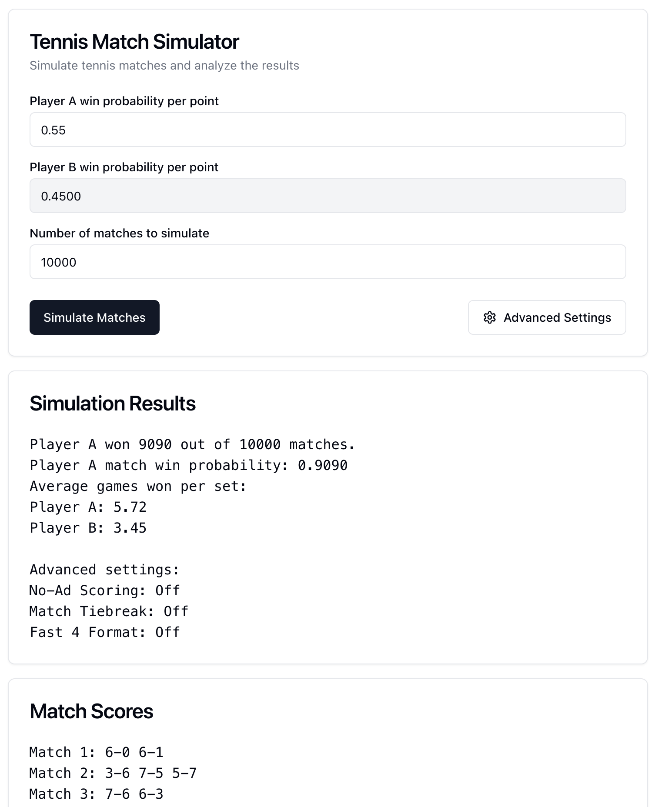

# Tennis match simulator
http://www.georgesung.com/tennis-match-simulator/

Ever wondered:
- What percentage of matches would I win if I "only" won 55% of the points?
- What percentage of points do I need to win to get just one game off a much better player?
- If I usually win/lose 10-5 when playing practice tiebreaks with my friend, what is my expected match score in a full match?

Example screenshot:



Given the win probability of a player on each point, simulate multiple tennis matches and analyze the results.

In this simple web app, you can specify the per-point win probability of a player, and the number of matches to simulate. After the simulations are complete, you can see the number of matches won, and other interesting stats. All the logic runs inside your own browser.

This web app uses Next.js and shadcn/ui

**Simulation caveats:**
This simulation assumes every point has an equal win probability for a given player. It does not take into account different win probabilities when serving/receiving, when the score is close and a player is nervous, players tanking when it's a blowout, etc.

## Local development
```
npm install
npm run dev
```

Go to `http://localhost:3000`.

## Deploy to GitHub Pages
You can host this simple web app for free on GitHub Pages, see instructions [here](https://docs.github.com/en/pages/getting-started-with-github-pages/creating-a-github-pages-site). In the GitHub Pages settings, select "GitHub Actions" for build & deployment, and from there you can choose the default next.js app deployment setup.

## Why did I build this?
I've always felt like writing a simulator for this, since I've been curious about these questions for a long time (see above). However, I've been very lazy to put this together.

Good news though: AI has gotten very good at coding simple things like this (I'm writing this on October 6, 2024). So when having my Sunday morning coffee, I played around with GPT 4o w/ Canvas, and got it to write a python simulator for tennis matches (conversation [here](https://chatgpt.com/share/6702697b-7770-800d-8289-e42a164c955d)). Before I even finished my coffee, the AI helped me write a valid simulator. There were some mistakes along the way so I had to iterate a bit, but overall it was pretty smooth. You can see the final python script [here](https://gist.github.com/georgesung/42387a7208ddc648b334716d6bf406e2). Since this is a python script, I am able to run it on my laptop, but what if this can run in any web browser?

Recently I've been learning some front-end development, so I thought it might be fun to build a simple web app to do this. I want all the logic to run in the user's browser so I can host a static website for free on GitHub Pages (I'm not paying any 💰💰 for this). I've been working with Next.js and shadcn/ui on a separate project, so I thought I'll stick with these libraries. So I went to the trusty Vercel v0 and asked it to help build my web app for me. I described the overall desired functionality and gave it some example inputs and outputs. Impressively, v0 got the simulation logic right the first try! It did a better job than GPT 4o w/ Canvas 😀 I didn't even need to show the final python code from above and have it convert that to typescript, that was nice. Thus, most of my conversation with v0 was about iterating on the UI itself. The full converation is [here](https://v0.dev/chat/aP0kDHVyXOf).

After that I went through a bunch of back and forth to figure out how to deploy this on GitHub Pages: a mix of asking ChatGPT and Perplexity a bunch of questions, old-fashioned Googling, and just randomly clicking around in GitHub. Actually randomly clicking around on GitHub is how I found it has a pre-made GitHub Actions template to deploy Next.js apps -- super helpful.
